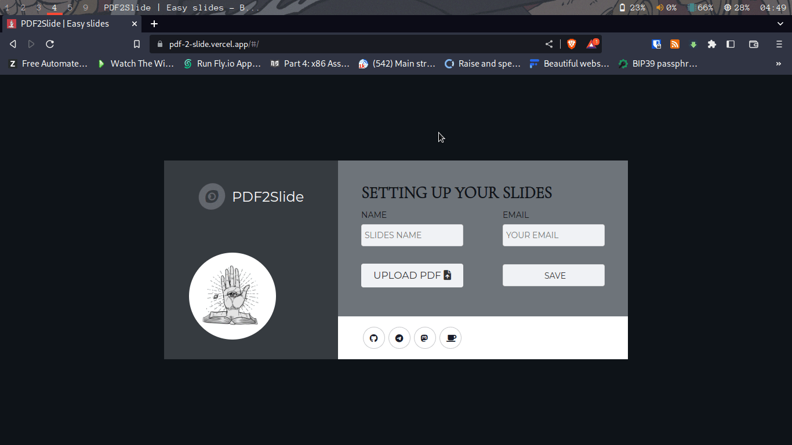

  

# PDF2Slide - Convert PDF to Slides (Frontend)

## Table of Contents

- [About](#about)
- [Demo](#demo)
- [Screenshots](#screenshots)
- [Technologies Used](#technologies-used)
- [Features](#features)
- [Development](#development)
  - [Prerequisites](#prerequisites)
  - [Installation](#installation)
- [Usage](#usage)
- [Contributing](#contributing)
- [Contact](#contact)

## About

This is the frontend of the project PDF2Slide. It's a tool that allows you to convert PDF files to slides. It's currently in development and you are strongly encouraged to help us improve it.

- Check out the Back-end [here](https://github.com/Rooyca/PDF-Vision-BE)

## Demo

- You can see a demo [here](https://pdf-2-slide.netlify.app/).
- Or you can see a showcase [here](https://portafolio.ankladigital.com/)

## Screenshots

## Technologies Used

- Celery (to make asynchronous tasks)
- Redis (to store queues)
- MongoDB (to store results)
- FastAPI (as backend)
- Vue 3 (as frontend)
- [NEW] Docker
- [NEW] https://transfer.sh/ (to store the images)
- [NEW] https://fly.io (to deploy)

## Features

- [x] Convert PDF to Slides.
- [x] Delete slides.
- [ ] Charging text when loading slides for the first time.
- [ ] Download slides.

## Development

### Prerequisites

- Node.js
- npm

### Installation

- Clone the repository
- Run `npm install` to install all the dependencies
- Run `npm run dev` to start the development server
- Go to `localhost:3000` to view the app

## Usage

- "If you want to delete a slide later, you must make sure to save the `delete key`, then you can go to the url `http://localhost:3000/del/{slide_id}/{delete_key}`

## Contributing

Contributions are always welcome! <3

## Contact

You can contact me at:

- [Mas.to](https://mas.to/@rooyca)
- [Telegram](https://t.me/seiseiseis)

